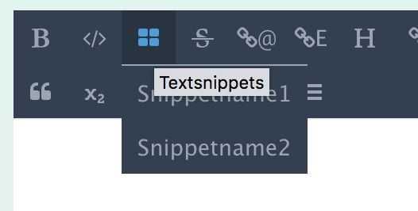

# markitUp! - Integrieren in Deine Entwicklung

Mit der Installation des AddOns markitUp! stehen Dir die default-Profile für markdown und textile zur Verfügung. Sie enthalten _alle_ Erweiterungen des jeweiligen Editors.

Für eine bedienerfreundliche Nutzung im System empfehlen wir Dir noch 3 Schritte für die Integration in REX:
* [Einschränken der Funktionen in den Editoren](#editoren)
* [Editoren um Textbausteine erweitern](#textbausteine)
* [Integration markdown](#markdown)
* [Integration textile](#textile)
* [Weitere Modul-Beispiele](#beispiele)

### Einschränken der Funktionen in den Editoren

Für den laufenden Betrieb empfielt es sich, die Editoren zu minimalisieren auf die Funktionen, die der Redakteur wirklich braucht. Das macht die Pflege deutlich komfortabler und auch die dadurch entstehenden Internetseiten werden konsistenter und "sauberer" im Code.

Beispiel für einen minimalisierten textile-Editor:

	groupheading[2|3|4|5|6], grouplink[internal|external|mailto|file], unorderedlist, orderedlist, sup, sub

### Editoren um Textbausteine erweitern

Über die Clip-Funktion können eigene Textbausteine im Editor bereitgestellt werden. Hier ein Basisbeispiel aus dem mitgelieferten Profil "markdown_full":

    bold,code,clips[Snippetname1=Snippettext1|Snippetname2=Snippettext2],deleted,emaillink, ....

Klick auf "Snippetname1" würde an der Cursorposition den Text "Snippettext1" einfügen. Komplexe oder größere Textbausteine sprengen schnell den Rahmen des Möglichen,
wenn man sie in der Profil-Konfiguration einbaut. Ergänzend kann in der Tabelle "Snippets" eine Textbausteinbibliothek erfasst werden.

Zuerst wird in der Snippet-Liste nach dem Textbaustein "Snippettext1" (um beim Beispiel zu bleiben) gesucht. Gibt es ihn, wird er in den Text eingebaut. Gibt es ihn nicht, wird wie zuvor "Snippettext1" in den Text eingebaut.

Es kann mehrere Snippets gleichen Namens geben für unterschiedliche Backendsprachen. Per Default gilt ein Textbaustein "für alle Sprachen". Wenn zu einem Snippettextnamen
mehrere Sprachvarianten existieren, wird wie folgt ausgewählt:

1. die Variante der aktuell eingestellten Backendsprache. Wenn nicht existent ...
2. ... die Variante "für alle Sprachen". Wenn nicht existent ...
3. ... die Variante einer der Fallback-Sprachen gem. Systemkonfiguration. Wenn nicht existent ...
4. ... wird der Snippettextname als Text übernommen.

## Integration markdown in ein Modul

### html (Basic)

#### Eingabe-Modul

Die entsprechende css-Klasse für den Editor vergibst Du unter [Profile](/redaxo/index.php?page=markitup/profiles).

	<?php
	if(!rex_addon::get('markitup')->isAvailable()) {
		echo rex_view::error('Dieses Modul ben&ouml;tigt das "markitUp!" Addon.');
	}
	?>
	

	  <label class="col-sm-2">Text</label>
	  

		<textarea class="form-control markitupEditor-markdown_full" id="value-1" name="REX_INPUT_VALUE[1]">REX_VALUE[1]</textarea>
	  

	

#### Ausgabe-Modul

	<?php
	  if ('REX_VALUE[id=1 isset=1]') {
		echo markitup::parseOutput ('markdown', 'REX_VALUE[id=1 output="html"]');
	  }
	?>

### mit MForm

#### Eingabe-Modul

Die entsprechende css-Klasse für den Editor vergibst Du unter [Profile](/redaxo/index.php?page=markitup/profiles).

	<?php
	if(!rex_addon::get('markitup')->isAvailable()) {
		echo rex_view::error('Dieses Modul ben&ouml;tigt das "markitup" Addon sowie das Profil markitupEditor-markdown_full.');
	}

	// instanziieren
	$mform = new MForm();

		// Text
		$mform->addTextAreaField(2, array('label'=>'Text', 'class'=>'markitupEditor-markdown_full'));

		// Ausrichtung Text
		$mform->addSelectField(10,array(0 => 'zentriert', 1 => 'links-bündig', 2 => 'rechts-bündig'), array('label'=>'Ausrichtung Text', "default-value" => "1"));

	// get formular
	echo $mform->show();

	?>

#### Ausgabe-Modul

	<?php

		$txtalign = "REX_VALUE[10]";
		$text = "REX_VALUE[id=2 output=html]";

		// ########## Ausgabe Backend
		if(rex::isBackend()) {

		echo "

";
		echo markitup::parseOutput ('markdown', $text);
		echo "

";

		echo "  ";

		echo "Ausrichtung des Textes: ";
				if ($txtalign == "0") { echo "zentriert "; }
				elseif ($txtalign == "1") { echo "links "; }
				elseif ($txtalign == "2") { echo "rechts "; }
		}

		// ########## Ausgabe Frontend
		else {

			// row
			echo "
\n";

			// column
			echo "
\n";

			// Text			
			echo markitup::parseOutput ('markdown', $text);

			echo "
\n
\n\n";
		}
	?>

&uarr; [zurück zur Übersicht](#top)

## Integration textile in ein Modul

### html (Basic)

#### Eingabe-Modul

Die entsprechende css-Klasse für den Editor vergibst Du unter [Profile](/redaxo/index.php?page=markitup/profiles).

	<?php
	if(!rex_addon::get('markitup')->isAvailable()) {
		echo rex_view::error('Dieses Modul ben&ouml;tigt das "markitUp!" Addon.');
	}
	?>
	

	  <label class="col-sm-2">Text</label>
	  

		<textarea class="form-control markitupEditor-textile_full" id="value-1" name="REX_INPUT_VALUE[1]">REX_VALUE[1]</textarea>
	  

	

#### Ausgabe-Modul

	<?php
	  if ('REX_VALUE[id=1 isset=1]') {
		echo markitup::parseOutput ('textile', 'REX_VALUE[id=1 output="html"]');
	  }
	?>

### mit MForm

#### Eingabe-Modul

Die entsprechende css-Klasse für den Editor vergibst Du unter [Profile](/redaxo/index.php?page=markitup/profiles).

	<?php
	if(!rex_addon::get('markitup')->isAvailable()) {
		echo rex_view::error('Dieses Modul ben&ouml;tigt das "markitup" Addon sowie das Profil markitupEditor-textile_default.');
	}

	// instanziieren
	$mform = new MForm();

		// Text
		$mform->addTextAreaField(2, array('label'=>'Text', 'class'=>'markitupEditor-textile_default'));

		// Ausrichtung Text
		$mform->addSelectField(10,array(0 => 'zentriert', 1 => 'links-bündig', 2 => 'rechts-bündig'), array('label'=>'Ausrichtung Text', "default-value" => "1"));

	// get formular
	echo $mform->show();

	?>

#### Ausgabe-Modul

	<?php

		$txtalign = "REX_VALUE[10]";
		$text = "REX_VALUE[id=2 output=html]";

		// ########## Ausgabe Backend
		if(rex::isBackend()) {

		echo "

";
		echo markitup::parseOutput ('textile', $text);
		echo "

";

		echo "  ";

		echo "Ausrichtung des Textes: ";
				if ($txtalign == "0") { echo "zentriert "; }
				elseif ($txtalign == "1") { echo "links "; }
				elseif ($txtalign == "2") { echo "rechts "; }
		}

		// ########## Ausgabe Frontend
		else {

			// row
			echo "
\n";

			// column
			echo "
\n";

			// Text			
			echo markitup::parseOutput ('textile', $text);

			echo "
\n
\n\n";
		}
	?>

&uarr; [zurück zur Übersicht](#top)

## Weitere Modul-Beispiele

... findest Du im Installer und via
* [Redaxo-Demo](https://github.com/FriendsOfREDAXO/demo_base)
* [Redaxo-Onepager](https://github.com/FriendsOfREDAXO/demo_onepage)
* [Redaxo Modul-Sammlung](https://github.com/FriendsOfREDAXO/Modulsammlung)

&uarr; [zurück zur Übersicht](#top)
